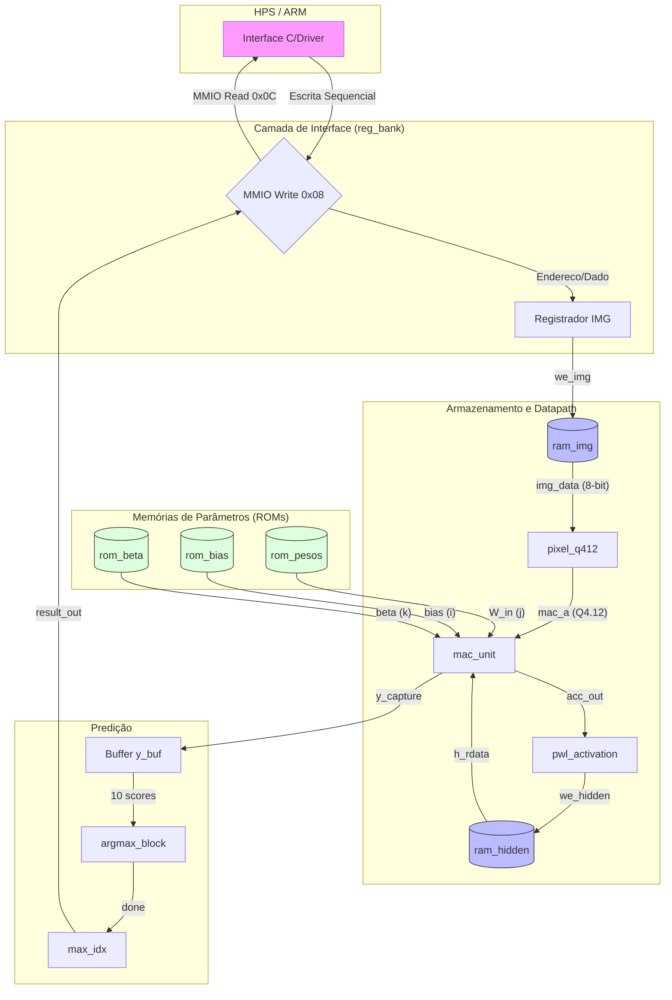

# Caminho do Dado: Arquitetura e Fluxo

Este documento descreve o fluxo de dados do co-processador `elm_accel`, desde a recepção dos pixels até a predição final.

## Diagrama de Fluxo Geral

O diagrama abaixo ilustra como os dados transitam entre os módulos e as memórias durante os diferentes estados da FSM.

## Descrição das Interações

1.  **Carga (HPS -> RAM)**: O HPS preenche a `ram_img` via `reg_bank`.
2.  **Hidden Layer**:
    *   Leitura de `ram_img` -> Atribuição para `pixel_q412`.
    *   `mac_unit` multiplica pixels por pesos de `rom_pesos` e soma o bias de `rom_bias`.
    *   O resultado passa por `pwl_activation` (tanh) antes de ser salvo em `ram_hidden`.
3.  **Output Layer**:
    *   Leitura de `ram_hidden` -> Multiplicação por pesos de `rom_beta`.
    *   O resultado acumulado (sem bias) é salvo no buffer `y_buf`.
4.  **Argmax**:
    *   O `argmax_block` varre o `y_buf` e encontra o índice do maior valor.
5.  **Retorno**:
    *   O índice final é disponibilizado no `reg_bank` para leitura pelo HPS.
